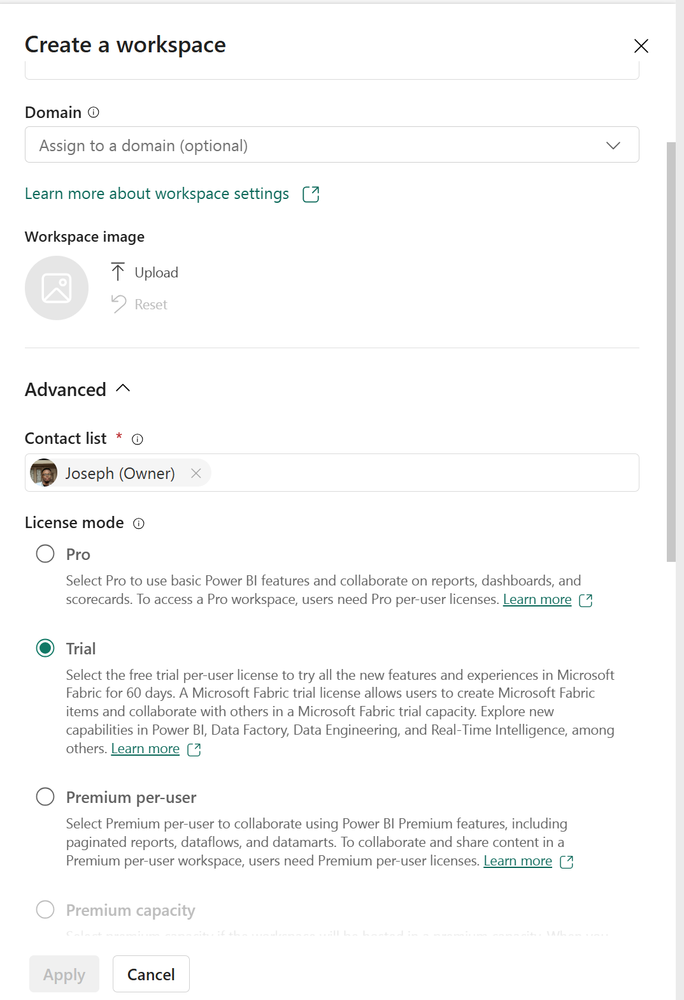

# Connecting Microsoft Fabric Database with Powerautomate
## Creating a Support system that loads data from microsoft forms into fabric database
Microsoft announced a major addition to the fabric space by introducing fabric database, I would take you through an interesting step by step approach to connect your forms data to the database directly using powerautomate
## Requirement
1. Fabric Trail or Fabric Capacity
2. Powerautomate Premium
   
## Steps
1. Create Fabric Database:
In a fabric enabled workspace

click on New Items
