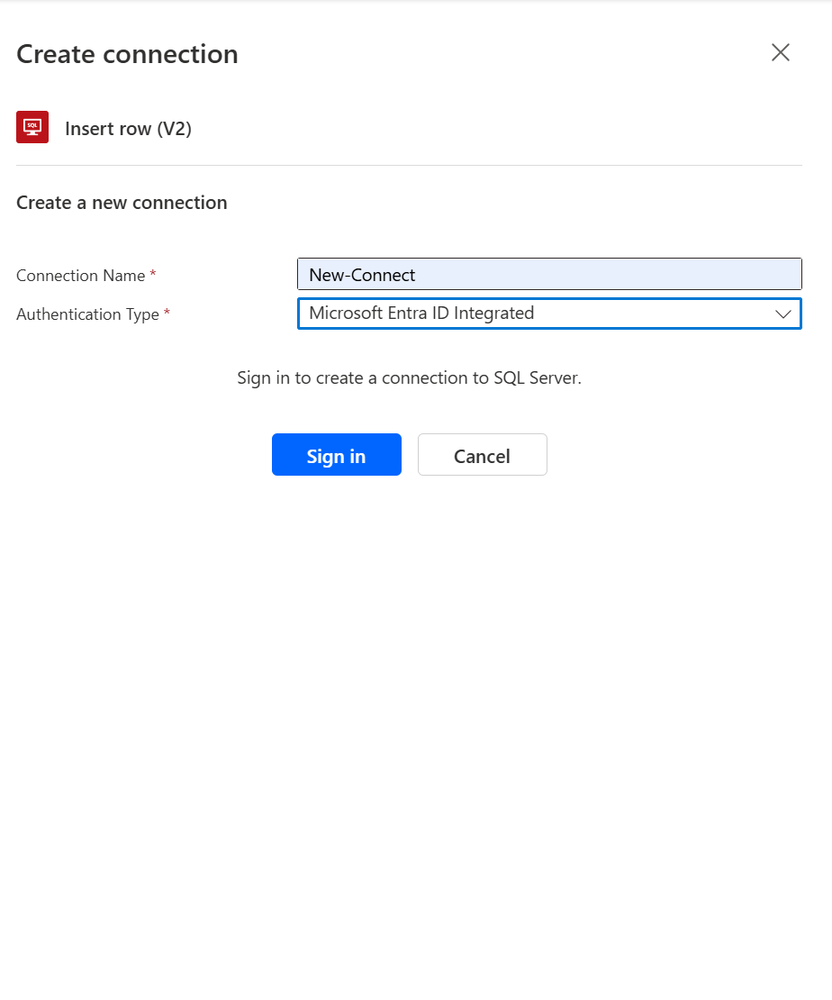

# Connecting Microsoft Fabric Database with Powerautomate
## Creating a Support system that loads data from microsoft forms into fabric database
Microsoft announced a major addition to the fabric space by introducing fabric database, I would take you through an interesting step by step approach to connect your forms data to the database directly using powerautomate
## Requirement
1. Fabric Trail or Fabric Capacity
2. Powerautomate Premium
   
## Steps
1. Create Fabric Database:
In a fabric enabled workspace

click on New Items, then select SQL database

Give your database a name, and load data into your database

2. Create Microsoft Forms:
Create a microsoft forms with your desired field, for this demo kindly see the fields below

3. Create Powerautomate flow:
Go to make.powerautomate.com, click on create automated cloud flow, give your flow a name,
Select when a new response is submitted from forms as the trigger, then get response details, and add the response id from the flow

Add an action to insert row from sql server, Click on new connection, select Microsoft entra ID

Under the server name Copy the Sever name immediately after the datasource for the connection string, then the database after the column of that, add dynamic contents of the response details

4. Test your flow

